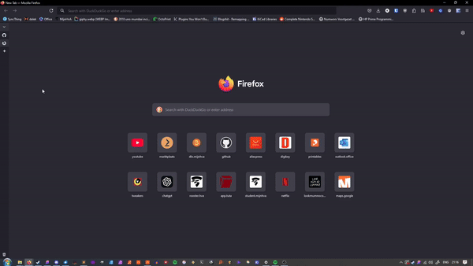

# Firefox autohide vertical tabs

Vertical tab goodness



## Setup

Download the files from the [latest release](https://github.com/roembol2000/ff-verttabs/releases/latest) -> Source code (zip)

### Sidebery

- Install the Sidebery add-on
- If you don't want the tree style tabs, you can disable them in the Sidebery settings under "Tabs tree structure"
- In the Sidebery settings, go to the Style Editor and paste in the contents of `sidebery.css`

### Autohide

- Open your profile directory by typing `about:support` in the address bar and pressing the "Open Directory" button under "Profile Directory"
- If it doesn't already exist, create a "chrome" directory in the profile directory
- Add the contents of the "chrome" directory in this repository to yours
- Your directory structure should look something like the following:

```
[profile dir]/
├─ extensions/
├─ chrome/
│  ├─ css/
│  │  ├─ vertical-tabs.css
│  ├─ userChrome.css
├─ crashes/
├─ storage/
├─ addons.json
├─ ...
```

- We need to tell Firefox to look for our custom CSS files. Go to `about:config`, search for 'userprof', and double click the toolkit.legacyUserProfileCustomizations.stylesheets preference to switch it to true.
- In the Firefox preferences, disable "Show sidebar" under Browser Layout.
- Restart Firefox

### Configuration

- By default, the original tab bar will be disabled. If you wish to keep the original tab bar around, you can enable it at the top of the vertical-tabs.css file.
  - To get your window controls back, right click on some blank space on the top bar and go to "Customize Toolbar...". There, turn on "Title Bar" at the bottom.
- You can also change the width and transition time / delay here.

## Updating

If an update broke the autohiding, I will try to fix the CSS. To update, simply replace the contents of the 'vertical-tabs.css' file with the new version in your userchrome directory (which can be found using the steps above).

- 2023-11-27: Initial release
- 2024-11-29: Fix compatibility with Firefox 133
- 2025-06-27: Fix compatibility with Firefox 140

## Thank you for using!

Please share :)
